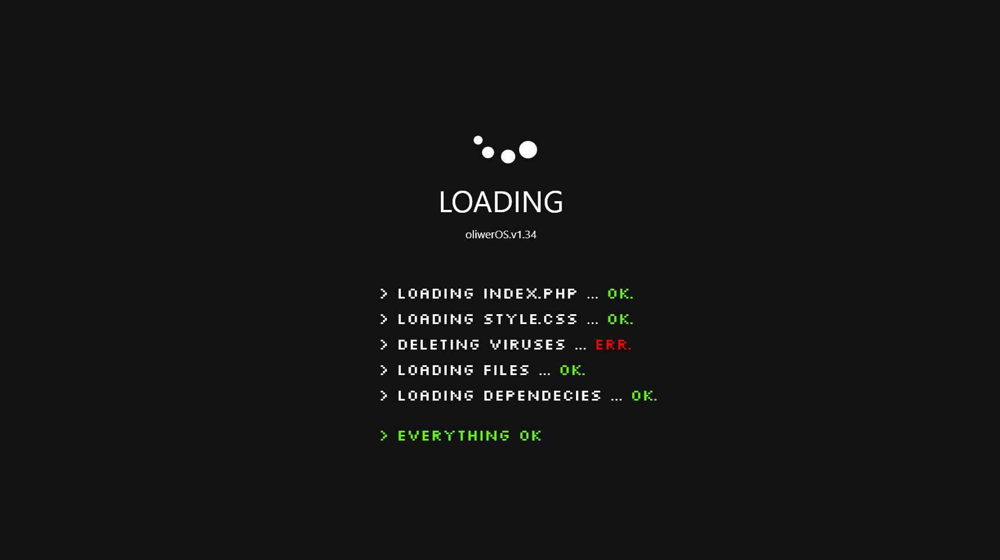
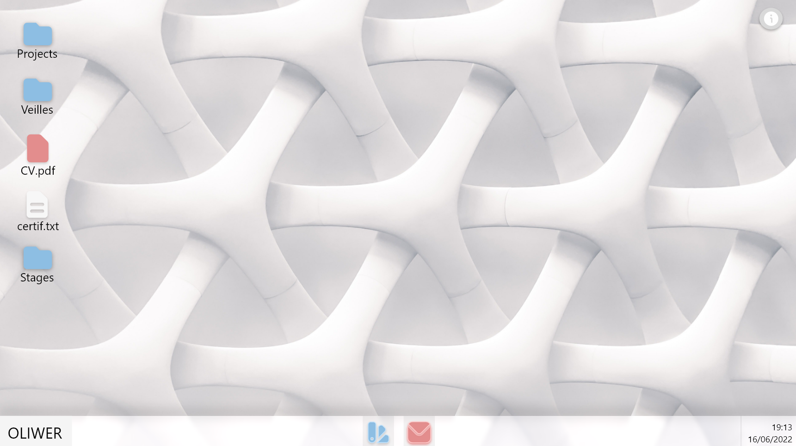
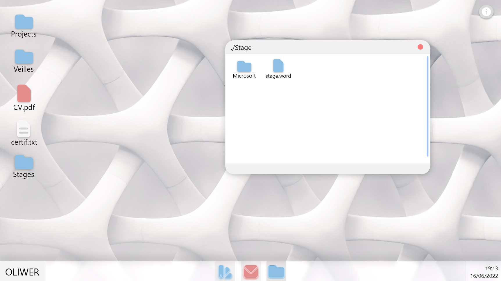

# Portfolio Swerk

## __>Introduction__

Ayant passé ma première année en BTS SIO, je voulais vraiment refaire mon Portfolio, qui était sous Wordpress. Grâce à mon expérience aquise en stage, je me suis dis que il était temps de le refaire.

Le concept serait une sorte de navigateur Windows, qui permettrait a l'utilisateurs de naviguer comme s'il utilisait un sytème d'éxploiatation. via cette page Github, vous pourrez suivre l'avancement du site.

[Le site est disponible ici](https://oliwerportfolio.alwaysdata.net/)

## __>A quoi ça ressemblera ?__

J'ai pu réaliser via AdobeXD, un prototype de mon site, à quoi ça devrait ressembler, au fur et à mesure, des nouvelles images seront rajoutées dans le dossier "includes/res/adobexd/". Les 3 images principales pour décrire le projet sont : 

### __>La page de chargement__ 

Cette page s'affichera lors du chargement du site web, avec bien évidemment une animation de chargement, et les éléments apparaissant petit à petit.

### __>L'index__

Une fois le site chargé, on arrivera sur cette page. Si besoin plus tard dans le projet, on affichera avant une page de connexion au site.

### Consulter un dossier

Après le chargement, nous pouvons accéder au fichier et dossier présent sur notre "bureau". Lorsque on ouvre un dossier, on a une fenêtre de ce dossier qui s'ouvrira.

## __>Contact__

Je suis preneur de tout conseil concernant le CSS, HTML, README, ect... 

Vous pouvez me contacter directement sur : 
 - Discord : Swerk#0911
 - Mail : oliwer721@gmail.com

